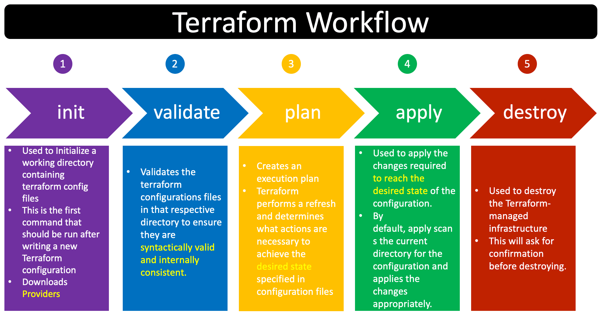

# Criando um cluster ECS, vpc e load balancer
Este repositório tem o objetivo de demonstrar como posso subir containers na AWS utilizando ECS.
---
## Sumário
1. [Sistema operacional](#sistema-operacional)
2. [Configurando AWS-CLI](#configurando-aws-cli)
3. [Pré-requisitos](#pré-requisitos)
4. [Arquitetura](#arquitetura)
5. [Terraform WorkFlow](#terraform-workflow)
6. [Configurando AWS VPC](#configurando-aws-vpc)
7. [Criando Subnet](#criando-subnet)
8. [Criando Internet Gateway](#criando-internet-gateway)
9. [Criando Nat Gateway](#criando-nat-gateway)
10. [IAM](#iam)
11. [Cluster ECS](#cluster-ecs)
12. [Application Load Balancer](#application-load-balancer)
---
## Sistema operacional
O sistema operacional usado para este tutorial é linux, caso você não use linux, considere pesquisar comandos equivalentes para o seu sistema operacional.

**Distro: Ubuntu 22.04**

## Pré-requisitos
- **Terraform**: o Terraform será nossa ferramenta de infra as code.
- **awscli**: awscli será a forma como iremos nos comunicar com a AWS, via chamada de api
- **Conta na AWS**: Será onde irá ser provisionado os recursos em cloud

## Criando diretório de trabalho

```shell
mkdir terraform-ecs-vpc/
cd terraform-ecs-vpc
```

## Arquitetura


## Configurando AWS-CLI
- Instalação
            nessa documentação você consegue instalar o aws cli para diferentes plataformas
            https://docs.aws.amazon.com/cli/latest/userguide/getting-started-install.html
- Criando usuário
    - Crie um usuário na aws, com permissão de administrador
    - Crie as chaves programáticas dele para poder ter acesso ao aws cli

depois rode o seguinte comando:

```shell
aws configure --profile terraform-profile 
```

-> o nome do profile pode ser qualquer um da sua escolha, após rodar este comando ele vai te pedir:
- Access Key Id
- Secret Acess Key
- Region -> para o nosso caso us-east1
- Default output format -> json

logo após rode este comando para verificar se realmente você está usando o perfil criado

```shell
aws sts get-caller-identity
```

---

## Terraform WorkFlow



## Criando provider.tf
Use o comando abaixo para criar o arquivo para o provider
```shell
touch provider.tf
```
https://registry.terraform.io/providers/hashicorp/aws/latest


```shell
terraform {
  required_providers {
    aws = {
      source = "hashicorp/aws"
      version = "5.53.0"
    }
  }
}

provider "aws" {
  region = "us-east-1"
  profile = "terraform-profile"
}
```

## Crie um bucket s3 na aws
https://docs.aws.amazon.com/pt_br/AmazonS3/latest/userguide/create-bucket-overview.html

nesse momento pode criar um bucket simples, não precisa configurar permissões nele

## Configurando Backend para salvar estados do terraform
```shell
touch backend.tf
```
Iniciando backend:

```shell
terraform {
  backend "s3" {
    bucket = "mybucket" 
    key    = "dev/" 
    region = "us-east-1"
  }
}
```
https://developer.hashicorp.com/terraform/language/settings/backends/s3

Depois que você criou o arquivo de provider e backend, rode o seguinte comando:

```shell
terraform init
```

esse comando vai baixar tudo que você configurou no seu provider e iniciar o seu backend que é onde vai ficar salvo o tfstate

## Configurando AWS VPC
O que é vpc?
Basicamente um rede virtual privada em cloud, que nos permite criar um ambiente isolado em nuvem.

Rode o comando abaixo para criar o arquivo que irá conter configurações de rede do nosso projeto
```shell
touch network.tf
```

É muito importante, que durante essa jornada com terraform você aprenda a se locomover na documentação dele, nosso caso agora, se você pesquisar por terraform aws vpc resource no google, você irá encontrar uma documentação com o recurso que queremos configurar que é a vpc.

https://registry.terraform.io/providers/hashicorp/aws/latest/docs/resources/vpc

```shell
resource "aws_vpc" "main" {
  cidr_block       = "10.0.0.0/16"

  tags = {
    Name = "vpc-ecs-demo"
  }
}
```

Uma coisa que muitos arquitetos pecam as vezes na hora de fazer a arquitetura de nuvem é na escolha do range da vpc, é necessário escolher um range que não seja tão comum para que em casos que você precise comunicar sua infraestrutura com a de outro cliente não aconteça o overlapping de ip, que é basicamente quando dois dispositivos possuem o mesmo endereço de rede.

para realizar os cálculos de range de ip, recomendo esse site:
https://www.vultr.com/resources/subnet-calculator/

Para o nosso caso usaremos um ip de exemplo.

## Criando Subnet
Para nossa arquitetura, iremos criar 4 subnets, 2 pública e 2 privada, "ah Igor mas o que caracteriza uma subnet ser publica ou privada?", subnet publica é toda subnet que possui rotas para um internet gateway, ou seja, por meio do IGW meu serviço consegue se comunicar com a internet, e a subnet privada por sua vez é uma subnet isolada da internet, e não possui rotas diretas para o internet gateway, subnets privadas só possuem comunicação com a internet por meio de um NAT gateway que reside em uma subnet publica, permitindo requisições de saída da subnet mas não de entrada

para o nosso caso, podemos criar o recurso de subnet duas vezes para simbolizar a subnet publica e a privada, logo após configuraremos o route table para que elas façam jus ao nome privada ou publica

```shell
resource "aws_subnet" "subnet_public_1a" {
  vpc_id            = aws_vpc.vpc-ecs-demo.id
  cidr_block        = "10.0.1.0/24"
  availability_zone = "us-east-1a"
  tags = {
    Name = "subnet-public-ecs-demo-a"
  }
}

```

```shell
resource "aws_subnet" "subnet_public_1b" {
  vpc_id            = aws_vpc.vpc-ecs-demo.id
  cidr_block        = "10.0.2.0/24"
  availability_zone = "us-east-1b"
  tags = {
    Name = "subnet-public-ecs-demo-b"
  }
}
```

```shell
resource "aws_subnet" "subnet_private_1a" {
  vpc_id            = aws_vpc.vpc-ecs-demo.id
  cidr_block        = "10.0.3.0/24"
  availability_zone = "us-east-1a"
  tags = {
    Name = "subnet-private-ecs-demo"
  }
}
```

```shell
resource "aws_subnet" "subnet_private_1b" {
  vpc_id            = aws_vpc.vpc-ecs-demo.id
  cidr_block        = "10.0.4.0/24"
  availability_zone = "us-east-1b"
  tags = {
    Name = "subnet-private-ecs-demo"
  }
}
```

https://registry.terraform.io/providers/hashicorp/aws/latest/docs/resources/subnet

## Criando Internet Gateway
Agora faremos a criação do internet gateway, que vai ser o responsável por ligar a nossa arquitetura de rede ao mundo externo

```shell
resource "aws_internet_gateway" "igw-ecs-demo" {
  vpc_id = aws_vpc.vpc-ecs-demo.id

  tags = {
    Name = "internet-gateway-ecs-demo"
  }
}
```

o internet gateway ele fica atrelado a vpc, portanto a ligação dele é pelo Id da vpc, mas para que a gente consiga realizar essa conexão precisamos usar um outro recurso do terraform:

```shell
resource "aws_internet_gateway_attachment" "igw-attach-ecs-demo" {
  internet_gateway_id = aws_internet_gateway.example.id
  vpc_id              = aws_vpc.example.id
}
```

## Criando Nat Gateway

https://registry.terraform.io/providers/hashicorp/aws/latest/docs/resources/nat_gateway

Teremos que criar um elastic Ip para colocar no Nat gateway, pois ele será o nosso ponto de saída da rede e logo após fazemos a criação do recurso

```shell
resource "aws_eip" "eip-ngw-ecs-demo" {
  domain = "vpc"
  tags = {
    Name = "eip-ecs-demo"
  }
}

resource "aws_nat_gateway" "nat-ecs-demo" {
  allocation_id = aws_eip.eip-ngw-ecs-demo.id
  subnet_id     = aws_subnet.subnet_public_1a.id
  tags = {
    Name = "nat-ecs-demo"
  }

  depends_on = [aws_internet_gateway.igw-ecs-demo]
}
```

## IAM
O que é o IAM?
Basicamente, é o recurso da AWS que nos permite gerenciar politicas de acesso, grupos de acessos e usuários.

-> Crie um arquivo iam.tf

```shell
touch iam.tf
```

Nós iremos utilizar uma politica que ja vem por padrão em toda conta da aws para atribuir a Role de execution task

```shell
resource "aws_iam_role" "ecs_task_execution_role" {
  name = "ecs_task_execution_role"

  assume_role_policy = jsonencode({
    Version = "2012-10-17"
    Statement = [
      {
        Effect = "Allow"
        Principal = {
          Service = "ecs-tasks.amazonaws.com"
        }
        Action = "sts:AssumeRole"
      }
    ]
  })
}

resource "aws_iam_role_policy_attachment" "ecs_task_execution_policy_attachment" {
  role       = aws_iam_role.ecs_task_execution_role.name
  policy_arn = "arn:aws:iam::aws:policy/service-role/AmazonECSTaskExecutionRolePolicy"
}
```

## Cluster ECS
-> Crie um arquivo ecs.tf

```shell
touch ecs.tf
```

Vamos fazer a criação do cluster ecs, nesse momento iremos ter algumas etapas para a criação até o container ficar acessível de fato


-> Criando cluster

```shell
resource "aws_ecs_cluster" "ecs-cluster-demo" {
  name = "ecs-cluster-demo"
}
```

https://registry.terraform.io/providers/hashicorp/aws/latest/docs/resources/ecs_cluster

-> Criando Capacity Provider

Nessa etapa, vamos usar um resource do terraform para informar para o nosso cluster que iremos usar o tipo de computação Fargate.

```shell
resource "aws_ecs_cluster_capacity_providers" "ecs-capacity_provider-demo" {
  cluster_name = aws_ecs_cluster.ecs-cluster-demo.name

  capacity_providers = ["FARGATE"]

  default_capacity_provider_strategy {
    base              = 1
    weight            = 100
    capacity_provider = "FARGATE"
  }
}
```

https://registry.terraform.io/providers/hashicorp/aws/latest/docs/resources/ecs_cluster_capacity_providers

-> Criando Task Definition

Iremos criar um resource que basicamente informa para o ECS, todos os detalhes sobre o container, porta, imagem, quantidade de recurso, é aqui que caso sua aplicação tenha variaveis de ambiente você irá colocar e aqui também será informada a task execution role

```shell
resource "aws_ecs_task_definition" "task-definition-demo" {
  family                   = "task-definition-demo"
  requires_compatibilities = ["FARGATE"]
  execution_role_arn       = aws_iam_role.ecs_task_execution_role.arn
  network_mode             = "awsvpc"
  cpu                      = 256
  memory                   = 512
  container_definitions = jsonencode([
    {
      name      = "task-definition-demo"
      image     = "nginx"
      cpu       = 256
      memory    = 512
      essential = true
      portMappings = [
        {
          containerPort = 80
          hostPort      = 80
        }
      ]
    }
  ])
}
```

https://registry.terraform.io/providers/hashicorp/aws/latest/docs/resources/ecs_task_definition


-> Criando Service

Este será o recurso do ECS que irá direcionar o tráfego para o container e gerenciar a execução de tarefas 

```shell
resource "aws_ecs_service" "service-ecs-demo" {
  name            = "service-ecs-demo"
  cluster         = aws_ecs_cluster.ecs-cluster-demo.id
  task_definition = aws_ecs_task_definition.task-definition-demo.arn
  desired_count   = 1
  launch_type     = "FARGATE"

  load_balancer {
    target_group_arn = aws_lb_target_group.ecs-tg-demo.arn
    container_name   = "task-definition-demo"
    container_port   = 80
  }

  network_configuration {
    subnets         = [aws_subnet.subnet_private_1a.id, aws_subnet.subnet_private_1b.id]
    security_groups = [aws_security_group.ecs_sg.id]
    assign_public_ip = true
  }


  depends_on = [
    aws_lb.alb,
    aws_lb_target_group.ecs-tg-demo,
    aws_lb_listener.http
  ]
}
```
https://registry.terraform.io/providers/hashicorp/aws/latest/docs/resources/ecs_service


-> Criando os security groups do cluster ECS

```shell
resource "aws_security_group" "ecs_sg" {
  name        = "ecs-sg"
  description = "Security group for ECS"
  vpc_id      = aws_vpc.vpc-ecs-demo.id

  ingress {
    from_port   = 80
    to_port     = 80
    protocol    = "tcp"
    cidr_blocks = ["0.0.0.0/0"]
  }

  egress {
    from_port   = 0
    to_port     = 0
    protocol    = "-1"
    cidr_blocks = ["0.0.0.0/0"]
  }
}
```
https://registry.terraform.io/providers/hashicorp/aws/latest/docs/resources/security_group

## Application Load Balancer
-> Crie um arquivo alb.tf

```shell
touch alb.tf
```

Para que nós possamos acessar a nossa aplicação, iremos utilizar um ALB para ser a ponte entre uma subnet publica e uma subnet privada

https://registry.terraform.io/providers/hashicorp/aws/latest/docs/resources/lb

```shell
resource "aws_lb" "alb" {
  name               = "alb-demo"
  internal           = false
  load_balancer_type = "application"
  security_groups    = [aws_security_group.alb_sg.id]
  subnets            = [aws_subnet.subnet_public_1a.id, aws_subnet.subnet_public_1b.id]

  enable_deletion_protection = false
}
```

-> Target group

```shell
resource "aws_lb_target_group" "ecs-tg-demo" {
  name        = "ecs-tg-demo"
  port        = 80
  protocol    = "HTTP"
  vpc_id      = aws_vpc.vpc-ecs-demo.id
  target_type = "ip"
  health_check {
      path                  = "/"
      protocol              = "HTTP"
      matcher               = "200"
      port                  = "traffic-port"
      healthy_threshold     = 2
      unhealthy_threshold   = 2
      timeout               = 10
      interval              = 30
  }
}
```

-> Listener

```shell
resource "aws_lb_listener" "http" {
  load_balancer_arn = aws_lb.alb.arn
  port              = "80"
  protocol          = "HTTP"

  default_action {
    type             = "forward"
    target_group_arn = aws_lb_target_group.ecs-tg-demo.arn
  }
}
```

-> Security Group do ALB

```shell
resource "aws_security_group" "alb_sg" {
  name        = "alb-sg"
  description = "Security group for ALB"
  vpc_id      = aws_vpc.vpc-ecs-demo.id

  ingress {
    from_port   = 80
    to_port     = 80
    protocol    = "tcp"
    cidr_blocks = ["0.0.0.0/0"]
  }

  egress {
    from_port   = 0
    to_port     = 0
    protocol    = "-1"
    cidr_blocks = ["0.0.0.0/0"]
  }
}
```
